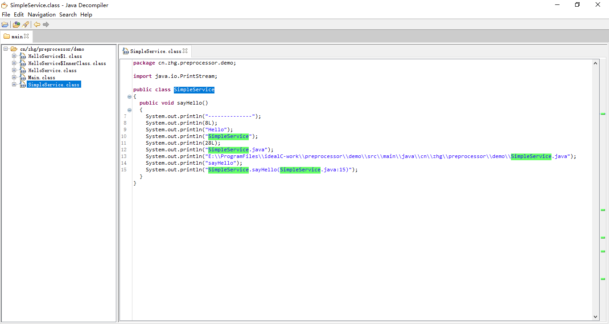

# Java预编译宏
## 支持关键字
参见[CompilerConstant](interfaces\src\main\java\cn\zhg\preprocessor\inter\CompilerConstant.java)
* `__LINE__` 行号
* `__COLUMN__`列号
* `__METHOD_NAME__`方法名
* `__CLASS_NAME__`类名
* `__FILE_NAME__`文件名
* `__LOCATION__`当前位置
* `__FILE_PATH__`文件路径
## 例子
参见[demo](demo)
```java
public class SimpleService implements CompilerConstant {
    public void sayHello() {
        System.out.println("--------------");
        System.out.println(__LINE__);
        System.out.println("Hello");
        System.out.println(__CLASS_NAME__);
        System.out.println(__COLUMN__);
        System.out.println(__FILE_NAME__);
        System.out.println(__FILE_PATH__);
        System.out.println(__METHOD_NAME__);
        System.out.println(__LOCATION__);
    }
}
```
生成结果
